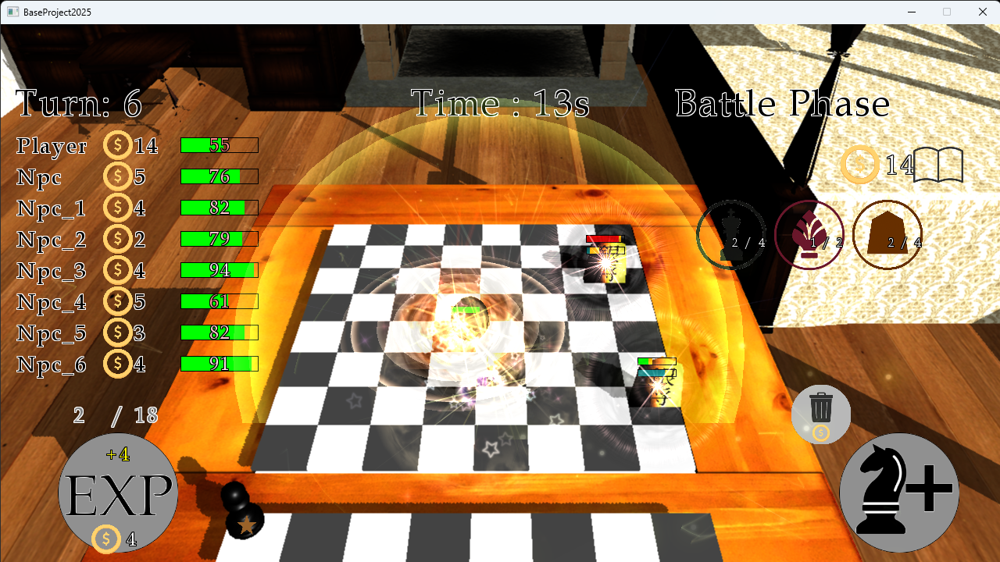

# DuelKings

  

  
  
  
  

駒を置くと、駒たちが自動でバトルを行う対戦ゲームです。

## プレイ動画

### ダウンロード（実行ファイル）
ビルドせずにすぐ遊びたい場合は、以下から実行ファイルを取得できます：

Releases (github.com in Bing) ページへ移動

最新の DuelKings.zip をダウンロード

展開して DuelKings.exe を実行するだけでプレイできます

ソースコードをビルドしなくても、すぐにゲームを試せます。

## 作者

**つきの**（山﨑 愛）

- GitHub: [@tsukinokun](https://github.com/tsukinokun)
- Qiita: [@tsukino_](https://qiita.com/tsukino_)
